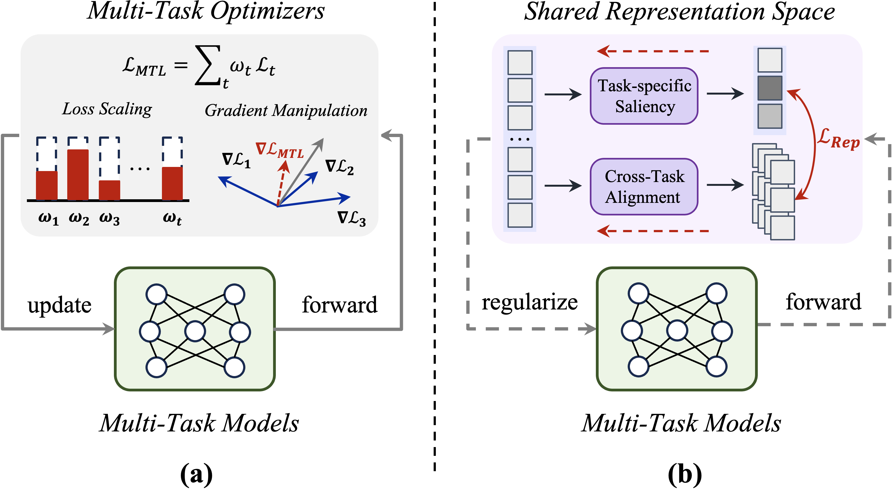

<div align="center">

# Rep-MTL: Unleashing the Power of Representation-level Task Saliency for Multi-Task Learning

<!-- ICCV 2025 Highlight -->
<div align="center" style="margin: 35px 0;">
  
</div>

<p align="center">
  <a href="https://jacky1128.github.io/repmtl-page/" style="text-decoration: none;">
    
  </a>
  <a href="https://jacky1128.github.io/RepMTL/" style="text-decoration: none;">
    
  </a>
  <a href="https://jacky1128.github.io/repmtl-page/" style="text-decoration: none;">
    
  </a>
</p>

<!-- Authors -->
**[Zedong Wang](https://jacky1128.github.io)<sup>1</sup>, [Siyuan Li](https://lupin1998.github.io)<sup>2</sup>, [Dan Xu](https://www.danxurgb.net)<sup>1</sup>**

<sup>1</sup>The Hong Kong University of Science and Technology, <sup>2</sup>Zhejiang University

</div>

<br/>
<br/>

<!-- Teaser -->
<div align="center">
  
  <p><em><strong>(a)</strong> Most existing optimizer-centric MTL methods largely focus on addressing conflicts in model update. <strong>(b)</strong> Our Rep-MTL instead exploits the shared representation space to explicitly facilitate cross-task information sharing while preserving task-specific learning signals via regularization without optimizer modifications.</em></p>
</div>


## Overview

Rep-MTL is a representation-level regularization method for multi-task learning that introduces task saliency-based objectives to encourage inter-task complementarity via Cross-task Saliency Alignment (CSA) while mitigating negative transfer among tasks via Task-specific Saliency Regulation (TSR).


## Updates
- **[July 24, 2025]** 🎉 Rep-MTL was selected as **Highlight** by ICCV 2025! We are working on cleaning and re-organizing our codebase. Stay tuned for updates!
- **[June 26, 2025]** Rep-MTL has been accepted to ICCV 2025!


## Contact

For questions or research exchanges, please reach out to [Zedong Wang](https://jacky1128.github.io) via `zedong.wang@connect.ust.hk`.


## BibTeX


```bibtex
@inproceedings{iccv2025repmtl,
  title={Rep-MTL: Unleashing the Power of Representation-level Task Saliency for Multi-Task Learning},
  author={Wang, Zedong and Li, Siyuan and Xu, Dan},
  booktitle={IEEE/CVF International Conference on Computer Vision (ICCV)},
  year={2025}
}
```


## Acknowledgements

We extend our gratitude to the excellent public repositories that have supported our work: [LibMTL](https://github.com/median-research-group/LibMTL), [CAGrad](https://github.com/Cranial-XIX/CAGrad), [MTAN](https://github.com/lorenmt/mtan), [FAMO](https://github.com/Cranial-XIX/FAMO), [Nash-MTL](https://github.com/AvivNavon/nash-mtl). We also thank the broader MTL community for their inspiring contributions.
